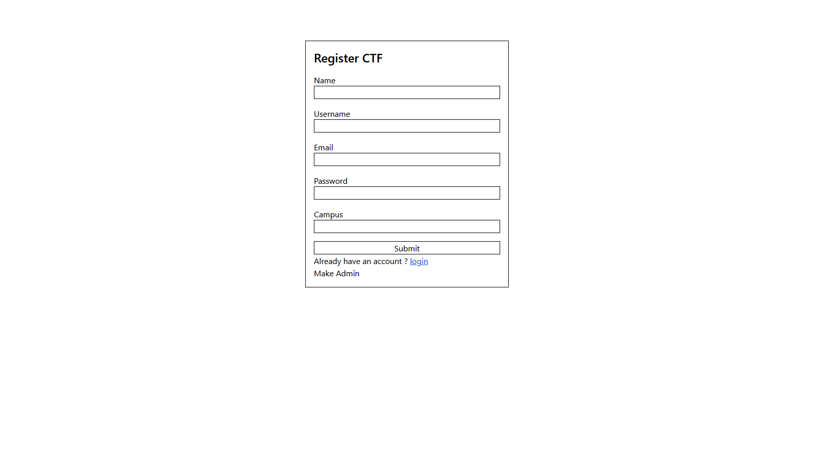
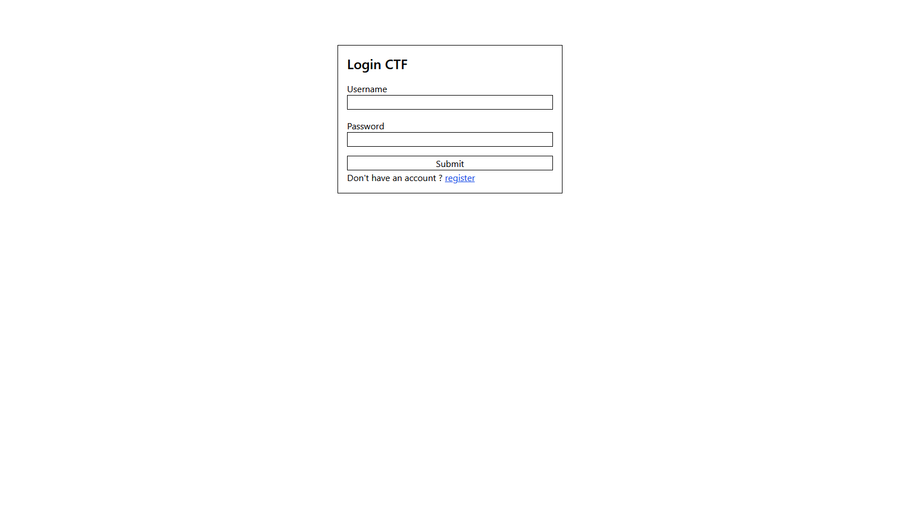
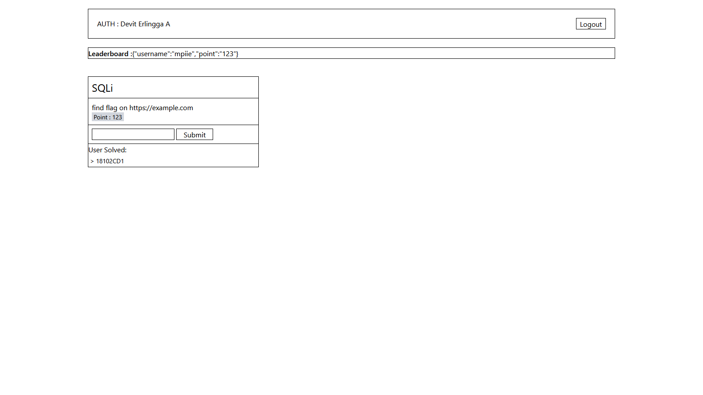
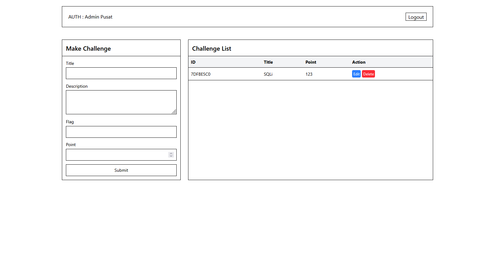

# Platform CTF - Day 5

Platform Capture The Flag (CTF) dengan JavaScript, OOP, dan  terintegrasi dengan localStorage.

pada website ini menerapkan oop sebagai model dengan penyimpanan localStorage agar ketika website di refresh maka data akan tetap tersimpan.

karena pada saat mengerjakan studi kasus ini saya hanya berfokus pada memenuhi fungsionalitas sehingga masih banyak duplicate code terjadi.

Rencana selanjutnya: 
+ Mencoba menerapkan prinsip dry untuk mempersingkat code dan membuatnya lebih rapi.
+ tambah fitur review challenge apa bila sudah di solve 

## Screenshots

### Registration Page


### Login Page  


### Participant Dashboard


### Admin Dashboard



##  Fitur Platform


###  Registration Page (`index.html`)

- **Form fields**: Name, Username, Email, Password, Campus
- **Auto-redirect**: Ke login page setelah registrasi

###  Login Page (`login.html`)

- **Simple form**: Username & Password
- **Role detection**: Auto redirect berdasarkan role
- **Session creation**: Menyimpan user session

###  Participant Home (`home.html`)

- **Auth status**: Menampilkan user yang login
- **Challenge list**: Grid layout semua challenge
- **Flag submission**: Input field per challenge
- **Leaderboard**:  ranking
- **Solved tracking**: Menampilkan user yang sudah solve

###  Admin Dashboard (`dashboard.html`)

- **Challenge form**: Create/Edit challenge
- **Challenge table**: List semua challenge dengan action buttons
- **CRUD operations**: Edit & Delete functionality
- **Admin status**: Menampilkan admin yang login


##  Konsep OOP yang Diterapkan

### 1. **Inheritance**

```javascript
// parent class
class User {
  constructor() {
  }
}
// Child class
class Participant extends User {
}
class Admin extends User {
}
```

### 2. **Encapsulation**

```javascript
class User {
  #_password; // Private field

  get password() {
    return this.#_password;
  }
}

class Challenge {
  #flag; // Private flag

  checkFlag(inputFlag) {
    return this.#flag === inputFlag;
  }
}
```

### 3. **Polymorphism**

```javascript

class Participant extends User {
  // override
  getAllData() {
  }
}

class Admin extends User {
  //override
  getAllData() {
  }
}
```


## Data Flow

```
1. User Registration → localStorage["ls-listParticipant"]
2. Admin List → localStorage["ls-listAdmin"]
3. Challenge List → localStorage["ls-listChall"]
4. Flag Submission → localStorage["ls-listSubmitSuccessFull"]
5. Leaderboard Update → localStorage["ls-leaderboardList"]
6. Session Management → localStorage["auth-user"]
```
